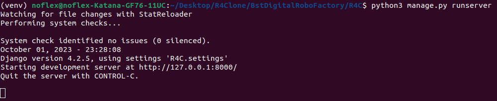

# R4C - Robots for consumers

## Небольшая предыстория.
Давным-давно, в далёкой-далёкой галактике, была компания производящая различных 
роботов. 

Каждый робот(**Robot**) имел определенную модель выраженную двух-символьной 
последовательностью(например R2). Одновременно с этим, модель имела различные 
версии(например D2). Напоминает популярный телефон различных моделей(11,12,13...) и его версии
(X,XS,Pro...). Вне компании роботов чаще всего называли по серийному номеру, объединяя модель и версию(например R2-D2).

Также у компании были покупатели(**Customer**) которые периодически заказывали того или иного робота. 

Когда роботов не было в наличии - заказы покупателей(**Order**) попадали в список ожидания.

---
## Что делает данный код?
Это заготовка для сервиса, который ведет учет произведенных роботов,а также 
выполняет некие операции связанные с этим процессом.

Сервис нацелен на удовлетворение потребностей трёх категорий пользователей:
- Технические специалисты компании. Они будут присылать информацию
- Менеджмент компании. Они будут запрашивать информацию
- Клиенты. Им будут отправляться информация
___

## Как с этим работать?
- Создать для этого проекта репозиторий на GitHub
- Открыть данный проект в редакторе/среде разработки которую вы используете
- Ознакомиться с задачами в файле tasks.md
- Написать понятный и поддерживаемый код для каждой задачи 
- Сделать по 1 отдельному PR с решением для каждой задачи
- Прислать ссылку на своё решение
___

## Инструкция по запуску:
Т.к. данный проект был реализован на ОС **Ubuntu**, то все нижеприведённые манипуляции и команды будут актуальны именно для неё.

- Открываем пераое окно терминала и создаём директорию, в которую в последствии будем клонировать проект (в данной инструкции "R4Clone") и переходим в неё:

> mkdir R4Clone

> cd R4Clone

- Инициализируем git-репозиторий:

> git init

- Клонируем проект из репозитория GitHub по с помощью ссылки:

> git clone https://github.com/n0fl3x/BstDigitalRoboFactory.git

- Переходим в директорию проекта и создаём виртуальное окружение (в данной инструкции "venv"):

> cd BstDigitalRoboFactory

> python3 -m venv venv

- Здесь же создаём файл ".env":

> touch .env

- Активируем виртуальное окружение:

> source venv/bin/activate

- Устанавливаем необходимые для проекта зависимости из файла "requirements.txt" (займёт какое-то время):

> pip install -r requirements.txt

- Далее открываем файл ".env" в Вашей IDE, текстовом редакторе или через тот же терминал с помощью редактора vim и указываем Django-ключ для проекта. В качестве шаблона заполнения можно использовать файл ".envexample", склонированный вместе с проектом:

- Далее в терминале переходим в директорию, содержащую файл "manage.py" и применяем миграции:

> cd R4C

> python3 manage.py makemigrations

> python3 manage.py migrate

- *(опциональный, но желательный пункт)*: Создаём учётную запись администратора проекта (после ввода команды следуйте инструкциям в терминале):

> python3 manage.py createsuperuser

- Последней операцией в данном окне терминала запускаем сервер:

> python3 manage.py runserver

- Для последующих манипуляций потребуется установка локального сервера redis. Вся необходимая информация для этого имеется в официальной документации на сайте Redis и доступна по ссылке:

*https://redis.io/docs/getting-started/installation/install-redis-on-linux/*

- После установки открывакем второе окно терминала, в котором запускаем локальный сервер Redis:

> redis-server

- Для проверки его работоспособности можно открыть ещё одно окно терминала и ввести команду "redis-cli ping". Если всё в порядке, в ответ в терминал должно вернуться сообщение "PONG". После этого данное окно терминала с проверочной командой можно закрыть:

- Наконец, открываем третье окно терминала и переходим в директорию проекта, где содержится папка "venv". Активируем виртуальное окружуние:

> cd R4Clone/BstDigitalRoboFactory

> source venv/bin/activate

- Переходим в директорию, содержащую файл "manage.py" и запускаем обработчик Celery:

> cd R4C

> celery -A R4C worker -pool=solo -l info

- **Именно в это окно терминала будут приходить емейл-оповещения о создании нового робота для заказа:**

___

### Для дальнейшего использования проекта:

- Сслыка для проверки 1 задания:

*http://127.0.0.1:8000/robots/api/robo-create/*

Для отправки запросов на данный URL-адрес для создания роботов можно использовать программу Postman.

- Сслыка для проверки 2 задания:

*http://127.0.0.1:8000/robots/excel-download/*

Можно так же использовать Postman, либо просто воспользоваться браузером.

- Для проверки 3 задания можно воспользоваться панелью администратора Django, зайдя в неё с помощью своих учётных данных:

*http://127.0.0.1:8000/admin/*

Необходимо создать заказчика в разделе **Customers**, а затем заказ в разделе **Orders**. Здесь же, в разделе **Robots** можно создать нужного робота и убедиться, что емейл пришёл в окно терминала, где запущен Celery.
